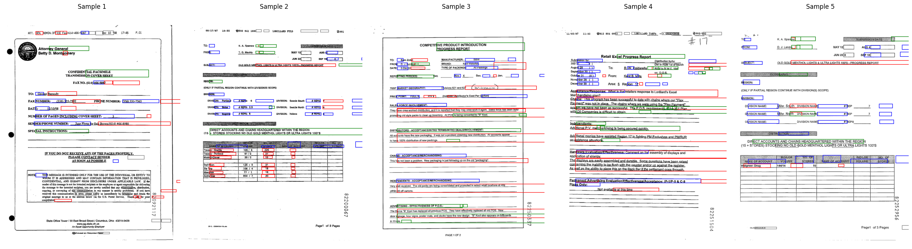

# MIMO Document AI: Multi-Modal Layout Analysis

An end-to-end document NER pipeline built in PyTorch that fuses language understanding with 2D spatial awareness to extract structured data from business documents (invoices, fax sheets, progress reports).

## The Engineering Problem

Standard NLP models fail on unstructured forms because they read text sequentially and ignore physical layout. The word "Name:" and the actual name next to it look the same to BERT — but they are spatially and structurally different entities.

## Architecture & Engineering Journey

### Phase 1 — Custom Architecture (from scratch)

I first engineered a custom Multi-Modal Transformer from scratch:
- **4 Spatial Embedding Tables:** Separate lookup tables for x1, y1, x2, y2 bounding box coordinates (1001 × 768 each), so the model can distinguish a left edge from a right edge at the same coordinate value
- **Fused Representation:** Text embeddings and spatial embeddings are added and normalized before being passed into BERT's transformer layers
- **Weighted CrossEntropy:** Down-weighted the dominant "O" class using inverse-frequency weights derived from the actual FUNSD label distribution

### Phase 2 — Diagnosing Failure

Training on FUNSD's 149 documents revealed a fundamental constraint. Through per-class recall logging I identified **mode collapse** — the model was predicting one class for 97% of all tokens:

```
I-ANSWER   pred=8354   actual=2485   recall=0.95
O          pred=0      actual=2358   recall=0.00
```

Root cause: PyTorch initializes `nn.Embedding` with `N(0,1)` by default, while BERT's internal embeddings use `N(0, 0.02)`. The spatial embeddings were **50× noisier** than the text signal, completely overwhelming BERT's representations at fusion time. Even after fixing initialization, training 110M+ parameters from scratch on 149 documents is insufficient — the spatial embeddings need document-scale pre-training to become meaningful.

### Phase 3 — Pivoting to LayoutLM

The custom architecture was essentially a re-implementation of **LayoutLM** (Microsoft, 2020) — BERT + 2D spatial position embeddings. The key difference: LayoutLM was pre-trained on **11 million** scanned documents before fine-tuning on FUNSD.

Switching to `microsoft/layoutlm-base-uncased` required changing ~15 lines of code while keeping the entire training and inference pipeline intact.

## Training Pipeline

- **Optimizer:** AdamW (`lr=5e-5`, `weight_decay=0.01`)
- **Loss:** Weighted CrossEntropy with inverse-frequency class weights
- **Regularization:** Gradient clipping (`max_norm=1.0`), dropout (`p=0.1`)
- **Early stopping:** Patience of 5 epochs tracked on validation accuracy
- **Checkpoint:** Best model saved by validation accuracy (not loss, since class weights distort the loss signal)

## Results

| Metric | Custom Model | LayoutLM Fine-tuned |
|---|---|---|
| Val Accuracy | ~29% (mode collapse) | **79.2%** |
| Val Loss (best) | 1.63 | **0.73** |
| Epochs to converge | Never | 10 |

Per-class recall at epoch 10:

| Class | Recall |
|---|---|
| O | 0.73 |
| B-HEADER | 0.62 |
| I-HEADER | 0.60 |
| B-QUESTION | 0.85 |
| I-QUESTION | 0.77 |
| B-ANSWER | 0.89 |
| I-ANSWER | 0.84 |

### Inference on 5 test documents

Green = HEADER &nbsp;|&nbsp; Blue = QUESTION &nbsp;|&nbsp; Red = ANSWER



## Dataset

[FUNSD](https://guillaumejaume.github.io/FUNSD/) — Form Understanding in Noisy Scanned Documents. 149 training / 50 test annotated business forms.

## Stack

- PyTorch
- HuggingFace Transformers (`layoutlm-base-uncased`)
- HuggingFace Datasets
- Pillow
