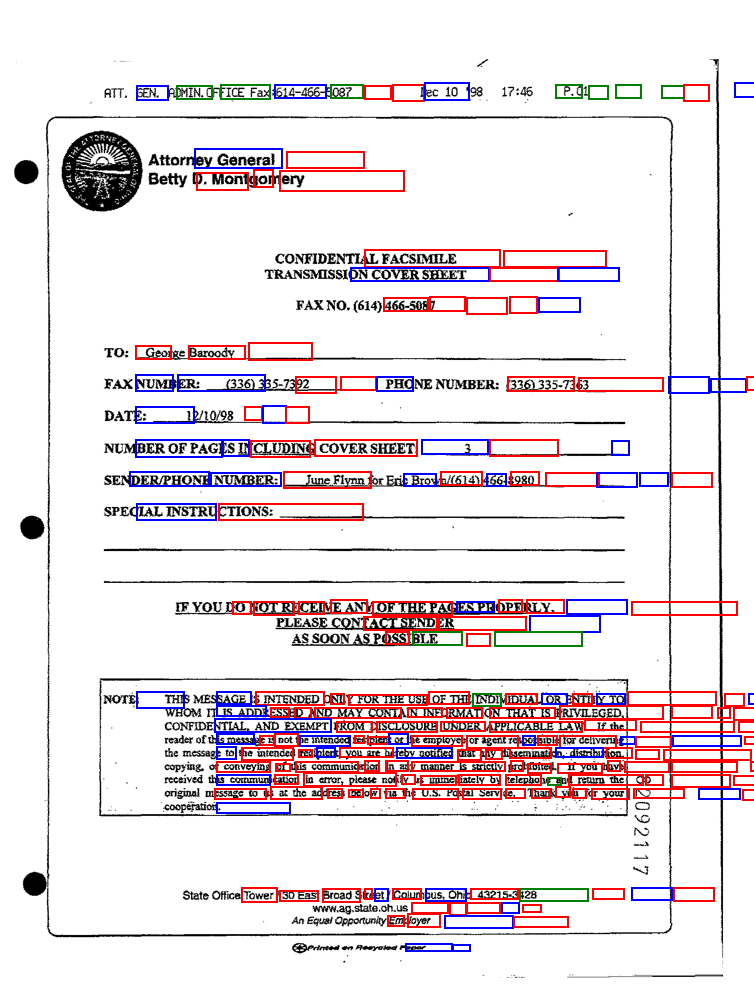

# MIMO Document AI: Multi-Modal Layout Analysis

An end-to-end custom PyTorch architecture that fuses NLP (BERT) with 2D spatial embeddings to extract structured data from business documents. 

## The Engineering Problem
Standard NLP models fail on highly unstructured forms (like invoices and faxes) because they read text sequentially and ignore the physical layout. 

## The Architecture & Solution
I engineered a custom Multi-Modal Transformer that intercepts a pre-trained language model and injects geometric awareness:
* **Spatial Embeddings:** Mapped $x$ and $y$ bounding box coordinates into a 768-dimensional vector space.
* **Overcoming Mode Collapse:** Implemented a Weighted CrossEntropy loss function to penalize the network for ignoring minority structural classes (Headers, Questions, Answers).
* **Differential Learning Rates:** Split the AdamW optimizer to maintain BERT's language understanding at `5e-5` while blasting the custom spatial layers with `5e-4` to rapidly learn document geometry.

## Results
Successfully extracted and classified entity relationships (NER) on the FUNSD dataset.

